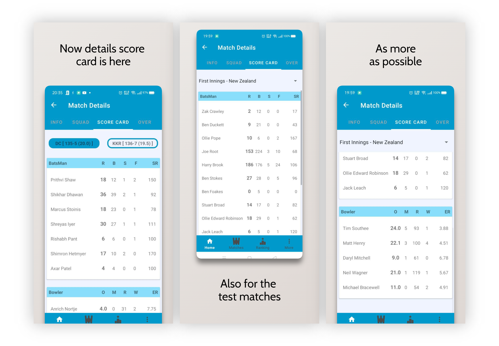
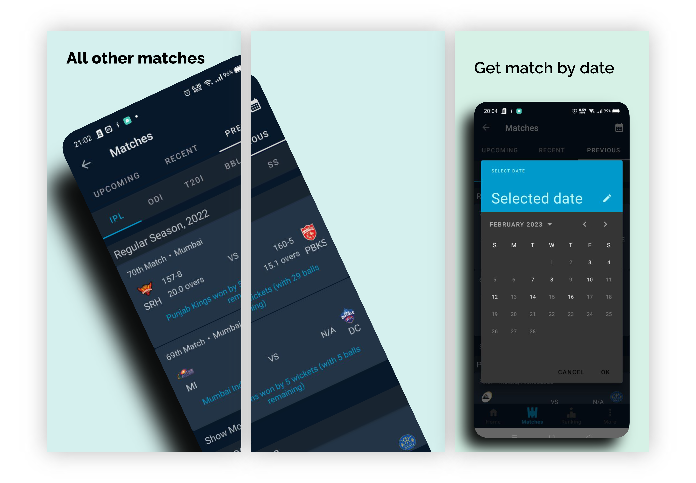

# Crickly

Crickly is the ultimate cricket game app for Android, built with Kotlin to provide a seamless user experience. It features live matches, match info, squad, scorecard, overs, and team rankings.

## Technology/Tools used

**IDE:** Android Studio

**Language:** Kotlin

**Database:** RoomDB

## Features

- Live Matches
[Live match details with winning percentage, current partnership, info, squad, scorecard, overs]
- Recent, Upcoming, and Previous Matches
[Matches with details]
- Team Rankings
[All kind of rankings: men and women]
- Team Search
[Searching option for team and show respective squad]
- Player Search
[Searching option for player and player details]
- Night Mode
[User can use the night mode ease for his/her eyes]
- Local Database
[Some data is also saved in local database so that if there is internet disconnection, user can have some information to surf]
- Notifications
[User will be notified 15 minutes before starting any match]

## Lessons Learned

**Time management:** 
- "This project taught me how to work under pressure and complete tasks within a tight deadline while maintaining a high level of professionalism."

- "Through this project, I learned how to prioritize tasks, manage my time effectively, and deliver high-quality work within the given timeline."

- "Completing this project within a limited time frame taught me the importance of setting realistic goals and milestones, which helped me stay focused and motivated throughout the project."

- "By applying a professional approach and keeping a close eye on the project timeline, I was able to deliver the final product to a high standard, meeting all project requirements and exceeding expectations."

- "I learned that by breaking down a project into smaller tasks, managing my time effectively, and keeping a clear focus on the project's objectives, I was able to complete the project within the given timeframe, while also ensuring a high-quality outcome."

**Problem solving**
- "This project required me to face various challenges and think creatively to overcome them. Through this experience, I learned how to identify problems, brainstorm solutions, and implement them effectively."

- "Completing this project required a lot of problem-solving skills as we faced unexpected challenges along the way. By being resourceful, thinking critically, and working collaboratively, we were able to overcome these challenges and deliver a successful project."

- "Through this project, I learned how to stay calm and focused under pressure when faced with unexpected obstacles. I developed the ability to analyze problems, identify the root causes, and develop effective solutions to address them."

- "By using a systematic and analytical approach to problem-solving, I was able to successfully complete the project and deliver high-quality work that met all project requirements."

- "This project was a great learning opportunity that taught me how to approach problems from different angles, think creatively, and experiment with new ideas to find effective solutions."

**Mentor Collaboration**
- "Collaborating with mentors on this project was a great opportunity to learn from their expertise and receive valuable feedback. Through their guidance, I learned how to generate new ideas and solutions that aligned with the project objectives."

- "Through this project, I learned how to work collaboratively with mentors and team members, exchanging ideas and feedback to generate innovative solutions that exceeded project expectations."

- "I learned that by maintaining open communication with mentors and team members, we were able to generate new and creative ideas that helped us achieve project goals and deliver high-quality work."

- "Working with mentors on this project allowed me to gain a new perspective and approach problem-solving in a more creative way. Through the process of exchanging ideas and feedback, I learned how to generate innovative solutions that met project objectives."

- "Through this project, I developed the ability to generate new and unique ideas by taking a collaborative approach and leveraging the expertise of mentors and team members. This helped us achieve project goals and deliver high-quality work."

**Improved technical skills:**
- "This project provided me with a valuable opportunity to improve my technical skills in working with API and Room database. I gained practical experience in implementing these technologies in a real-world scenario, which helped me to deepen my understanding of their functionalities."

- "Through this project, I learned how to effectively integrate and manage API and Room database into an Android application. This involved developing a clear understanding of their underlying architecture, designing efficient data models, and implementing effective data storage and retrieval mechanisms."

- "Working with API and Room database on this project helped me to hone my technical skills and learn how to build high-quality Android applications that are optimized for performance and user experience."

- "Through this project, I gained practical experience in implementing RESTful API and Room database, which helped me to develop a deep understanding of their capabilities and limitations. This enabled me to design and implement effective data storage and retrieval mechanisms that met the project requirements."

- "This project was a great learning experience that helped me to improve my technical skills in working with API and Room database. I learned how to implement best practices in data management, handle data efficiently, and improve application performance."

**Screenshots**

